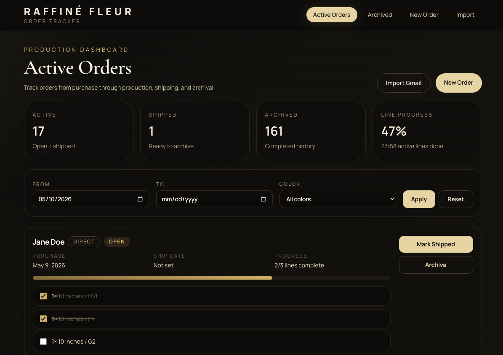
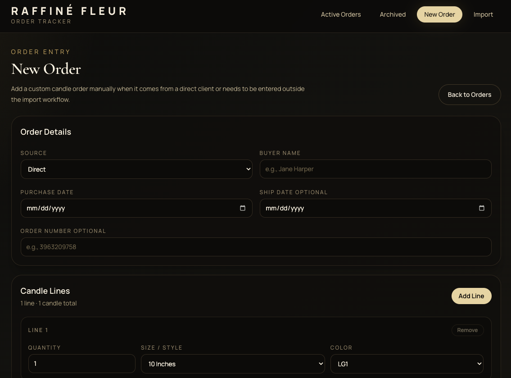
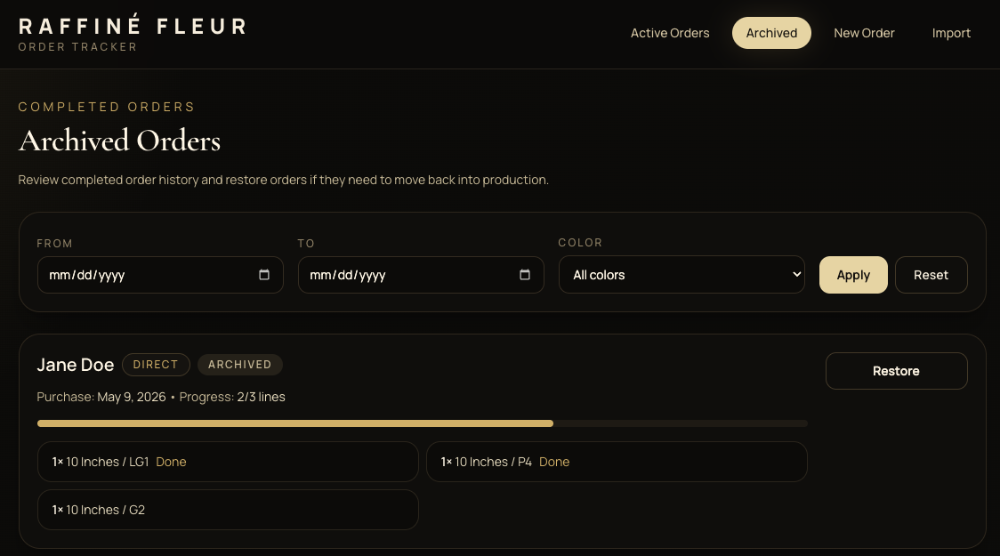
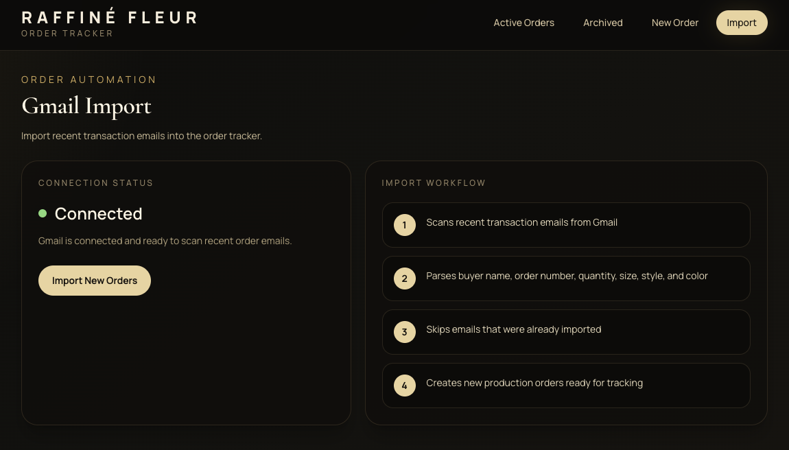

# Raffiné Fleur Order Platform — Customer Order & Production Tracking System

Raffiné Fleur Order Platform is a private internal order management system built to support a custom candle business. The platform helps manage Etsy and direct orders, track production progress, organize candle line items, and streamline fulfillment workflows.

This repository is a public case study for the project. The original application code is private because it supports real business operations and may contain sensitive implementation details.

## Project Overview

Raffiné Fleur needed a better way to manage custom candle orders as the business grew. Manual tracking became difficult as orders included different candle sizes, colors, styles, production timelines, and shipping statuses.

I built an internal order tracker to make it easier to enter new orders, import Etsy order information, monitor production progress, mark individual candle lines as complete, ship orders, archive completed work, and review order history.

The platform was designed around practical business needs: reducing manual tracking, improving production visibility, and making it easier to prioritize custom orders.

## Tech Stack

**Frontend:** React, TypeScript, Next.js, Tailwind CSS  
**Backend:** Next.js server actions, API routes  
**Database:** Prisma, SQLite  
**Tools:** Git, GitHub, Node.js  
**Other:** Gmail/Etsy import workflow, production tracking, order status management

## Key Features

- Active order dashboard with production summary cards
- Customer order entry form for direct and Etsy orders
- Candle line item tracking by quantity, size/style, and color
- Individual item completion tracking with progress indicators
- Order filtering by date range and candle color
- Gmail/Etsy import workflow for faster order entry
- Mark shipped, archive, and restore order actions
- Archived order history for completed work
- Responsive dark luxury dashboard UI for internal business use

## My Contributions

I designed and built the order tracking platform to support my own custom candle business operations.

My work included:

- Built the order dashboard for tracking active, shipped, and archived orders.
- Created a reusable order item editor for adding multiple candle lines per order.
- Implemented production progress tracking for individual candle line items.
- Added filtering by purchase date and candle color to make order review faster.
- Built archive and restore workflows for managing completed orders.
- Improved the interface with a polished black and cream luxury dashboard style.
- Created an import workflow to support Etsy/Gmail order processing.
- Designed the system around real production needs, including order prioritization, fulfillment tracking, and customer order organization.

## Screenshots

### Active Order Dashboard

### New Order Form

### Archived Orders

### Gmail / Etsy Import

## What I Learned

This project strengthened my experience with:

- Building practical full-stack software for a real business workflow
- Designing internal tools around actual user and operational needs
- Creating reusable React components for forms, filters, and order cards
- Managing database-backed order data with Prisma
- Building API and server-action workflows in Next.js
- Improving UI polish, layout consistency, and screenshot-ready presentation
- Thinking through data privacy when presenting private business software publicly

## Project Status

The application is private and used as an internal business tool. This case study summarizes the project, screenshots, technical approach, and business problem solved without exposing private source code or customer information.

## Future Improvements

Potential future improvements include:

- Add a dedicated analytics dashboard for sales, production volume, and turnaround time
- Add priority levels for rush orders and event deadlines
- Add customer communication notes and order history
- Improve Etsy/Gmail parsing for more automated order creation
- Add user authentication for protected admin access
- Add automated tests for order creation, filtering, and status updates
- Deploy a sanitized public demo version with sample data
